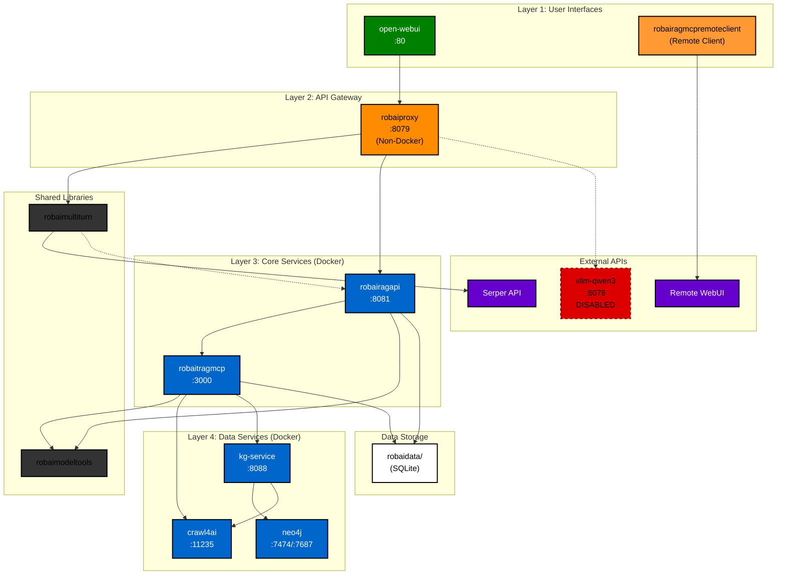

# Service Name Mapping - Docker Compose Reference

This document maps the service names in the master `docker-compose.yml` to their source files and explains the naming conventions.

## Architecture Diagram



**Legend:**
- **Solid** = Active | **Dashed** = Disabled/Optional
- **Orange** = Non-Docker | **Green** = UI | **Blue** = Docker | **Purple** = External | **Gray** = Libraries | **Brown** = Remote Client

## Service Inventory

| Master Service Name | Source File | Child Service Name | Container Name | Purpose |
|---------------------|-------------|-------------------|----------------|---------|
| `crawl4ai` | `robaicrawler/docker-compose.yml` | `crawl4ai` | `crawl4ai` | Web content extraction |
| `neo4j` | `robaikg/docker-compose.yml` | `neo4j` | `neo4j-kg` | Graph database |
| `kg-service` | `robaikg/docker-compose.yml` | `kg-service` | `kg-service` | KG extraction service |
| `robaitragmcp` | `robaitragmcp/docker-compose.yml` | `mcp-server` | `robaimcp` | MCP server (RAG + KG) |
| `robairagapi` | `robairagapi/docker-compose.yml` | `robairagapi` | `robairagapi` | REST API bridge |
| `open-webui` | `robaiwebui/docker-compose.yml` | `open-webui` | `robai-webui` | Chat interface |

**Disabled**: `vllm-qwen3` (commented out in master docker-compose.yml)

## Naming Convention

### Pattern 1: Direct Mapping
When the master service name matches the child service name exactly:
```yaml
# Master docker-compose.yml
vllm-qwen3:
  extends:
    file: ./robaivllm/docker-compose.yml
    service: vllm-qwen3  # ← Same name
```

**Examples**: `vllm-qwen3`, `crawl4ai`, `neo4j`, `kg-service`, `open-webui`

### Pattern 2: Parent-Child Mapping
When the master uses a different name than the child (for clarity or to avoid conflicts):

```yaml
# Master docker-compose.yml
robaitragmcp:  # ← Parent name (descriptive)
  extends:
    file: ./robaitragmcp/docker-compose.yml
    service: mcp-server  # ← Child name (generic)
```

**Example**: `robaitragmcp` extends `mcp-server`

**Why**: The child uses generic name `mcp-server` (could be any MCP server), but parent uses `robaitragmcp` to identify it as the RobAI TRAG MCP implementation.

### Pattern 3: Project-Scoped Naming
Service name reflects the project/component:

```yaml
robairagapi:  # ← Project name in service
  extends:
    file: ./robairagapi/docker-compose.yml
    service: robairagapi  # ← Matches project
```

**Examples**: `robairagapi` (RobAI RAG API), `robaitragmcp` (RobAI TRAG MCP)

---

## Service Dependencies

### Dependency Graph

```
Level 0 (No Dependencies):
└─ crawl4ai

Level 1 (Depends on Level 0):
└─ neo4j (waits for crawl4ai healthy)

Level 2 (Depends on Level 1):
└─ kg-service (waits for neo4j healthy)

Level 3 (Depends on Level 2):
└─ robaitragmcp (waits for crawl4ai + kg-service healthy)

Level 4 (Depends on Level 3):
└─ robairagapi (waits for robaitragmcp healthy)

Level 5 (Optional UI):
└─ open-webui (waits for robairagapi started)
```

### Startup Order

```
1. crawl4ai (no dependencies)
2. neo4j (waits for crawl4ai healthy)
3. kg-service (waits for neo4j healthy)
4. robaitragmcp (waits for crawl4ai + kg-service healthy)
5. robairagapi (waits for robaitragmcp healthy)
6. open-webui (waits for robairagapi started)
```

---

## Port Mappings

| Service | Internal Port | External Port | Protocol | Purpose |
|---------|--------------|---------------|----------|---------|
| `crawl4ai` | 11235 | 11235 | HTTP | Crawl4AI API |
| `neo4j` | 7474, 7687 | 7474, 7687 | HTTP, Bolt | Neo4j Browser, Bolt protocol |
| `kg-service` | 8088 | 8088 | HTTP | KG extraction API |
| `robaitragmcp` | 3000 | localhost only | TCP | MCP stdio over TCP (socat) |
| `robairagapi` | 8081 | 8081 | HTTP | REST API |
| `open-webui` | 8080 | 80 | HTTP | Web UI |

**Note**: All services use `network_mode: "host"` except `open-webui` which uses explicit port mapping.

---

## Volume Mappings

| Service | Host Path | Container Path | Purpose |
|---------|-----------|----------------|---------|
| `robaitragmcp` | `./robaidata` | `/data` | SQLite database |
| `robairagapi` | `./robaidata` | `/data` | Shared data access |
| `kg-service` | Named volume: `kg-models` | `/app/models` | GLiNER models |
| `neo4j` | Named volume: `neo4j-data` | `/data` | Graph database |
| `open-webui` | Named volume: `open-webui_open-webui` | `/app/backend/data` | UI data |

---

## Service Start Commands

### Start All Services
```bash
cd /home/robiloo/Documents/robaitools
docker compose up -d
```

### Start Specific Service (and dependencies)
```bash
# Start only kg-service and its dependencies
docker compose up -d kg-service

# This will start: crawl4ai, neo4j, kg-service
```

### Start Without Optional Services
```bash
# Start everything except Open WebUI
docker compose up -d crawl4ai neo4j kg-service robaitragmcp robairagapi
```

---

## Environment Variable Propagation

### Master → Child Override

Environment variables defined in master `docker-compose.yml` **override** child values:

```yaml
# Master docker-compose.yml
kg-service:
  extends:
    file: ./robaikg/docker-compose.yml
    service: kg-service
  environment:
    - NEO4J_PASSWORD=${NEO4J_PASSWORD:-knowledge_graph_2024}  # ← Overrides child
```

### Precedence Order (Highest to Lowest)

1. **Master docker-compose.yml** environment block
2. **.env file** in robaitools/ root
3. **Child docker-compose.yml** environment block
4. **Dockerfile** ENV statements
5. **Code defaults**

---

## Service Health Checks

| Service | Health Check | Interval | Timeout | Start Period |
|---------|--------------|----------|---------|--------------|
| `crawl4ai` | HTTP GET /health | 30s | 10s | 60s |
| `neo4j` | cypher-shell query | 30s | 10s | 60s |
| `kg-service` | HTTP GET /health | 30s | 10s | 120s |
| `robaitragmcp` | TCP check port 3000 | 30s | 10s | 60s |
| `robairagapi` | None | - | - | - |
| `open-webui` | None | - | - | - |

**Dependency Wait Conditions**:
- `service_healthy` - Waits for healthcheck to pass (used for crawl4ai, neo4j, kg-service, robaitragmcp)
- `service_started` - Waits for container to start (used for robairagapi → open-webui)

---

## Verification Commands

### List All Services
```bash
docker compose config --services
```

**Expected Output**:
```
crawl4ai
neo4j
kg-service
robaitragmcp
robairagapi
open-webui
```

### Check Service Status
```bash
docker compose ps
```

### View Service Logs
```bash
# All services
docker compose logs -f

# Specific service (by master name)
docker compose logs -f robaitragmcp
docker compose logs -f kg-service
```

### Inspect Service Configuration
```bash
# Show full resolved configuration
docker compose config

# Show only one service
docker compose config robaitragmcp
```

---

## Common Issues

### Issue: Service name not found

**Error**: `service "xyz" is not supported`

**Cause**: Using child service name instead of master service name

**Solution**: Use the master service name from first column of Service Inventory table

```bash
# ❌ Wrong (child name)
docker compose up -d mcp-server

# ✅ Correct (master name)
docker compose up -d robaitragmcp
```

### Issue: Cannot override environment variable

**Error**: Variable not being set correctly

**Solution**: Environment variables must be defined in the **master** docker-compose.yml to override child values:

```yaml
# Master docker-compose.yml
robaitragmcp:
  extends:
    file: ./robaitragmcp/docker-compose.yml
    service: mcp-server
  environment:  # ← Add here to override
    - MY_VAR=${MY_VAR:-default}
```

### Issue: Volume not found

**Error**: `volume "xyz" is not found`

**Cause**: Volume not declared in master volumes section

**Solution**: Add to master docker-compose.yml:

```yaml
volumes:
  xyz:
    name: xyz
```

---

## Service-to-Service Communication

### Internal Communication (Docker Network)

Services communicate via `localhost` due to `network_mode: "host"`:

```python
# kg-service connects to neo4j
NEO4J_URI = "bolt://localhost:7687"

# robaitragmcp connects to kg-service
KG_SERVICE_URL = "http://localhost:8088"

# robairagapi connects to robaitragmcp
MCP_SERVER_HOST = "localhost"
MCP_SERVER_PORT = 3000
```

### External Communication (Host to Services)

From host machine:

```bash
# Crawl4AI
curl http://localhost:11235/health

# KG Service
curl http://localhost:8088/health

# RAG API
curl http://localhost:8081/api/v1/stats \
  -H "Authorization: Bearer your-api-key"

# Open WebUI
open http://localhost:80
```

---

## Related Documentation

- [MIGRATION.md](MIGRATION.md) - Migration guide from old setup
- [FIXES.md](FIXES.md) - Critical docker-compose fixes applied
- [CONFIGURATION.md](CONFIGURATION.md) - Environment variable reference
- [docker-compose.yml](docker-compose.yml) - Master orchestration file

---

## Summary

**Total Services**: 6
- 1 Core (Crawl4AI)
- 2 Knowledge Graph (Neo4j, KG Service)
- 2 RAG (MCP Server, API Bridge)
- 1 UI (Open WebUI)

**Service Name Pattern**:
- Use **master service name** for docker compose commands
- Child service names are internal to their files
- Some services use different names (e.g., `robaitragmcp` → `mcp-server`)

**Dependency Levels**: 6 levels (0-5)

**Health Checks**: 4 services have healthchecks, 2 services don't

**Startup Time**: ~2-3 minutes for all services to become healthy
